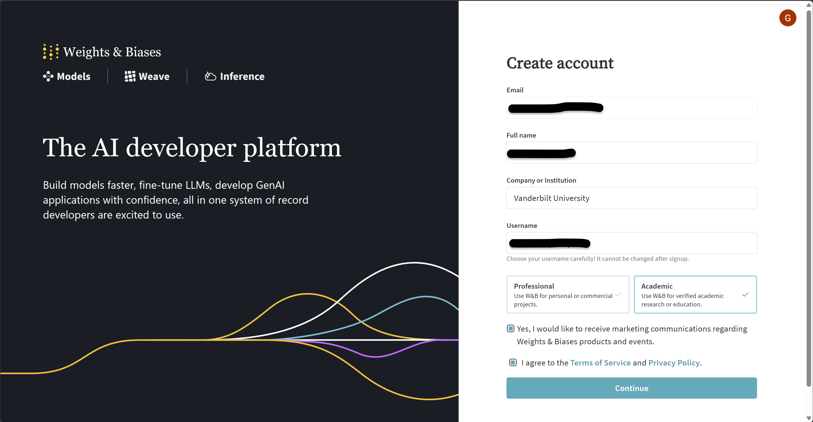
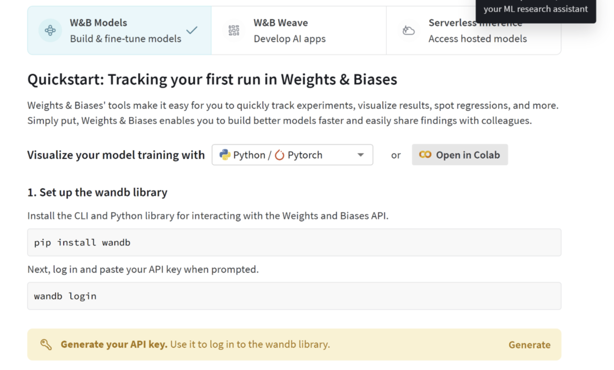

# 🎓 Thriva AI - Demo setup

[](https://python.org)
[](https://pytorch.org)
[](LICENSE)
[](https://wandb.ai)

**Thrive AI** demonstrating the power and simplicity of **setting up and using remote GPU servers** for machine learning experiment tracking and visualization using Autoencoders.

## 🚀 Getting Started

Follow these steps to set up Weights & Biases, connect to Delta AI, and start training.

### Step 1: Create a Weights & Biases Account

1. Go to [https://wandb.ai](https://wandb.ai).
2. Click **Login** in the top-right corner of the page.
3. Select **Sign in with Google** and sign in with your Google account.
4. After signing in, you will see a screen asking you to select your role. Select **Academic**.



5. Once you select Academic, you will land on your W&B settings page. Click **Generate API Key**, then copy the API key and save it somewhere safe on your device.



> **Warning:** Do not share your API key with anyone. Do not commit it to GitHub, post it publicly, or include it in any shared files. This key is for your eyes and your eyes only.

### Step 2: Connect to Delta AI

Open a terminal and SSH into the Delta cluster. Replace `NCSA_USERNAME` with your actual NCSA username:

```bash
ssh NCSA_USERNAME@login.delta.ncsa.illinois.edu
```

### Step 3: Install uv

Before cloning the repository, install [uv](https://docs.astral.sh/uv/), a fast Python package manager:

```bash
curl -LsSf https://astral.sh/uv/install.sh | sh
```

After installation, restart your shell or run the following to make `uv` available in your current session:

```bash
source $HOME/.local/bin/env
```

### Step 4: Clone the Repository and Install Dependencies

Clone this repository using HTTPS and install the dependencies with `uv`:

```bash
git clone https://github.com/GauravR1206/AI_Summer_School.git
cd AI_Summer_School
uv sync
```

### Step 5: Log in to Weights & Biases

Run the following command and paste your API key when prompted:

```bash
wandb login
```

### Step 6: Request a GPU

Submit an interactive GPU job on Delta:

```bash
srun -A bfep-delta-gpu --partition=gpuA40x4-interactive \
     --nodes=1 --gpus-per-node=1 --cpus-per-task=4 --mem=16g \
     --time=00:20:00 --pty bash
```

Wait until you are assigned a GPU. Once you have a GPU, activate your virtual environment:

```bash
source .venv/bin/activate
```

### Step 7: Train the Autoencoder

Now run the autoencoder training script:

```bash
python train_AE.py --epochs 20 --latent_dim 2
```

Once training begins, you will see a link printed in the terminal that takes you to your W&B dashboard. Open that link to monitor your model's training in real time — you'll see live loss curves, latent space visualizations, and all logged metrics.

#### 🎛️ Available Arguments
```
--epochs        Number of training epochs (default: 20)
--batch_size    Batch size for training (default: 128)
--lr            Learning rate (default: 1e-3)
--latent_dim    Dimensionality of latent space (default: 2)
--project       W&B project name (default: mnist-ae/mnist-vae)
--entity        W&B entity/team name (optional)
--data_dir      Directory to store MNIST data (default: ./data)
--save_dir      Directory to save checkpoints (default: ./checkpoints)
--seed          Random seed for reproducibility (default: 42)
```
## 📝 License

This project is licensed under the [MIT License](LICENSE) - see the LICENSE file for details.

